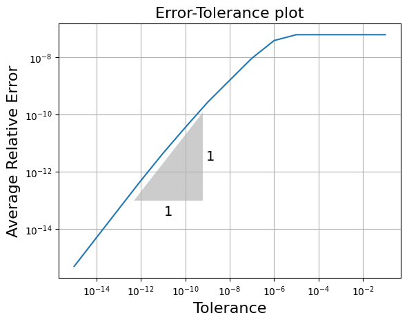
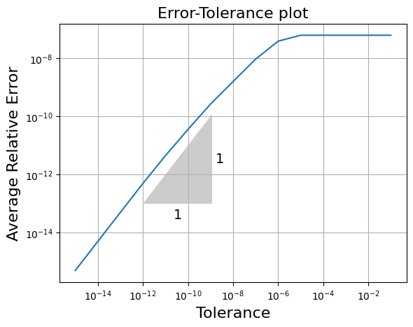
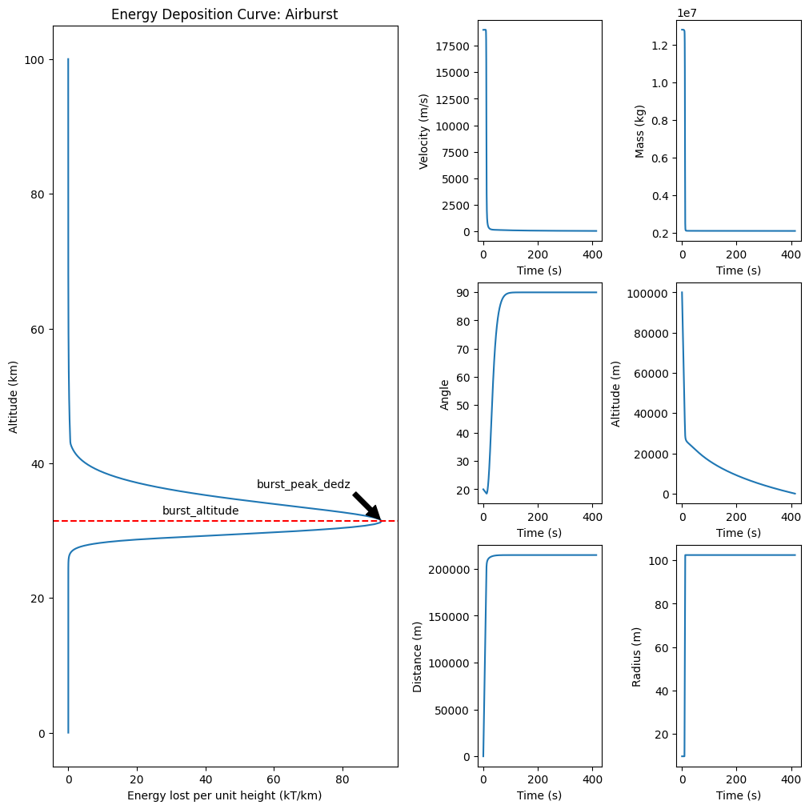
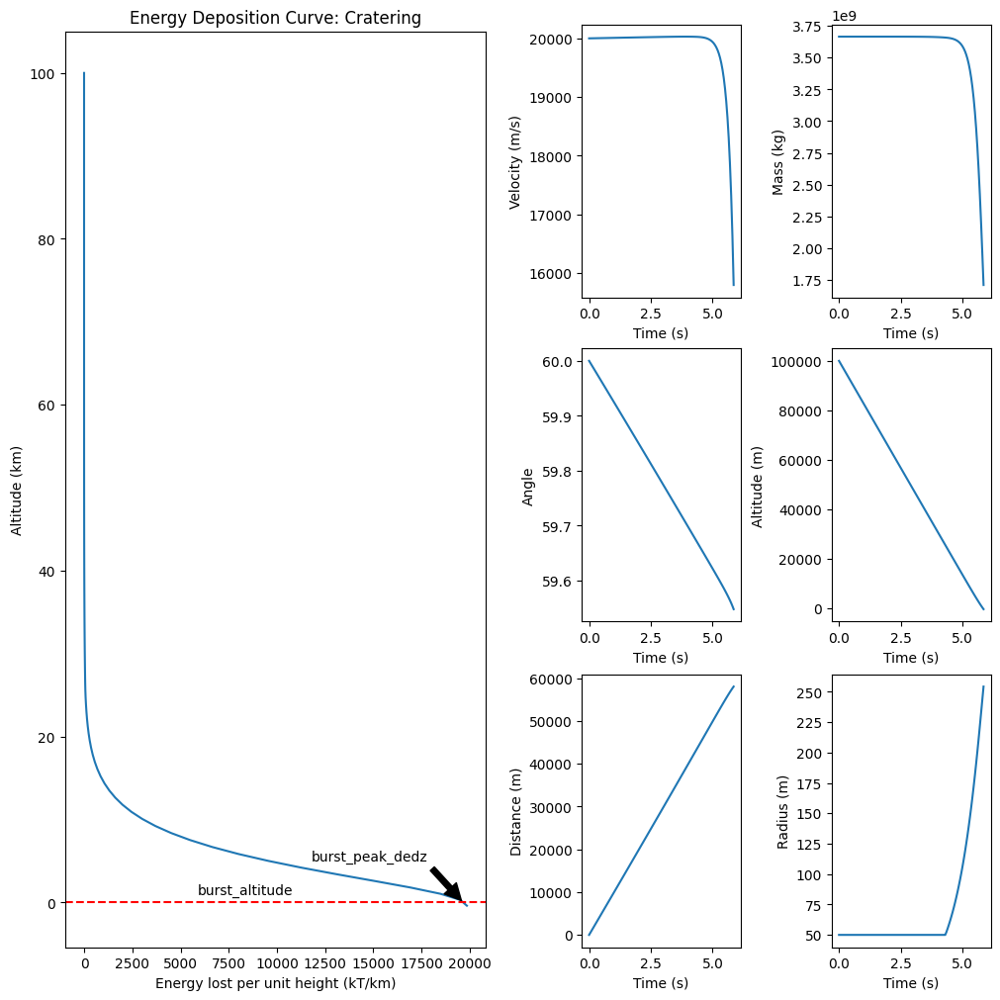
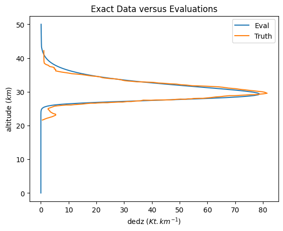

Project 1: Armageddon - The hazard of small asteroids
=====================================================

Synopsis:
---------

Asteroids entering Earth’s atmosphere are subject to extreme drag forces
that decelerate, heat and disrupt the space rocks. The fate of an
asteroid is a complex function of its initial mass, speed, trajectory
angle and internal strength.

`Asteroids <https://en.wikipedia.org/wiki/Asteroid>`__ 10-100 m in
diameter can penetrate deep into Earth’s atmosphere and disrupt
catastrophically, generating an atmospheric disturbance
(`airburst <https://en.wikipedia.org/wiki/Air_burst>`__) that can cause
`damage on the ground <https://www.youtube.com/watch?v=tq02C_3FvFo>`__.
Such an event occurred over the city of
`Chelyabinsk <https://en.wikipedia.org/wiki/Chelyabinsk_meteor>`__ in
Russia, in 2013, releasing energy equivalent to about 520 `kilotons of
TNT <https://en.wikipedia.org/wiki/TNT_equivalent>`__ (1 kt TNT is
equivalent to :math:`4.184 \times 10^{12}` J), and injuring thousands of
people (`Popova et al.,
2013 <http://doi.org/10.1126/science.1242642>`__; `Brown et al.,
2013 <http://doi.org/10.1038/nature12741>`__). An even larger event
occurred over
`Tunguska <https://en.wikipedia.org/wiki/Tunguska_event>`__, a
relatively unpopulated area in Siberia, in 1908.

This simulator predicts the fate of asteroids entering Earth’s atmosphere,
and provides a hazard mapper for an impact over the UK.

Problem definition
------------------

Equations of motion for a rigid asteroid
~~~~~~~~~~~~~~~~~~~~~~~~~~~~~~~~~~~~~~~~

The dynamics of an asteroid in Earth’s atmosphere prior to break-up is
governed by a coupled set of ordinary differential equations:

.. math::
   :nowrap:

   \begin{aligned} 
   \frac{dv}{dt} & = \frac{-C_D\rho_a A v^2}{2 m} + g \sin \theta \\
   \frac{dm}{dt} & = \frac{-C_H\rho_a A v^3}{2 Q} \\
   \frac{d\theta}{dt} & = \frac{g\cos\theta}{v} - \frac{C_L\rho_a A v}{2 m} - \frac{v\cos\theta}{R_P + z} \\
   \frac{dz}{dt} & = -v\sin\theta \\
   \frac{dx}{dt} & = \frac{v\cos\theta}{1 + z/R_P}
   \end{aligned}

In these equations, :math:`v`, :math:`m`, and :math:`A` are the asteroid
speed (along trajectory), mass and cross-sectional area, respectively.
We will assume an initially **spherical asteroid** to convert from
inital radius to mass (and cross-sectional area). :math:`\theta` is the
meteoroid trajectory angle to the horizontal (in radians), :math:`x` is
the downrange distance of the meteoroid from its entry position,
:math:`z` is the altitude and :math:`t` is time; :math:`C_D` is the drag
coefficient, :math:`\rho_a` is the atmospheric density (a function of
altitude ), :math:`C_H` is an ablation efficiency coefficient, :math:`Q`
is the specific heat of ablation; :math:`C_L` is a lift coefficient; and
:math:`R_P` is the planetary radius. All terms use MKS units.

Asteroid break-up and deformation
~~~~~~~~~~~~~~~~~~~~~~~~~~~~~~~~~

A commonly used criterion for the break-up of an asteroid in the
atmosphere is when the ram pressure of the air interacting with the
asteroid :math:`\rho_a v^2` first exceeds the strength of the asteroid
:math:`Y`.

.. math:: \rho_a v^2 = Y

Should break-up occur, the asteroid deforms and spreads laterally as it
continues its passage through the atmosphere. Several models for the
spreading rate have been proposed. In the simplest model, the fragmented
asteroid’s spreading rate is related to its along trajectory speed
`(Hills and Goda, 1993) <http://doi.org/10.1086/116499>`__:

.. math::  \frac{dr}{dt} = \left[\frac{7}{2}\alpha\frac{\rho_a}{\rho_m}\right]^{1/2} v

Where :math:`r` is the asteroid radius, :math:`\rho_m` is the asteroid
density (assumed constant) and :math:`\alpha` is a spreading
coefficient, often taken to be 0.3. It is conventional to define the
cross-sectional area of the expanding cloud of fragments as
:math:`A = \pi r^2` (i.e., assuming a circular cross-section), for use
in the above equations. Fragmentation and spreading **ceases** when the
ram pressure drops back below the strength of the meteoroid
:math:`\rho_a v^2 < Y`.

Airblast damage
~~~~~~~~~~~~~~~

The rapid deposition of energy in the atmosphere is analogous to an
explosion and so the environmental consequences of the airburst can be
estimated using empirical data from atmospheric explosion experiments
`(Glasstone and Dolan,
1977) <https://www.dtra.mil/Portals/61/Documents/NTPR/4-Rad_Exp_Rpts/36_The_Effects_of_Nuclear_Weapons.pdf>`__.

The main cause of damage close to the impact site is a strong (pressure)
blastwave in the air, known as the **airblast**. Empirical data suggest
that the pressure in this wave :math:`p` (in Pa) (above ambient, also
known as overpressure), as a function of explosion energy :math:`E_k`
(in kilotons of TNT equivalent), burst altitude :math:`z_b` (in m) and
horizontal range :math:`r` (in m), is given by:

.. math::
   :nowrap:

   \begin{equation*}
      p(r) = 3.14 \times 10^{11} \left(\frac{r^2 + z_b^2}{E_k^{2/3}}\right)^{-1.3} + 1.8 \times 10^{7} \left(\frac{r^2 + z_b^2}{E_k^{2/3}}\right)^{-0.565}
   \end{equation*}

For airbursts, we will take the total kinetic energy lost by the
asteroid at the burst altitude as the burst energy :math:`E_k`. For
cratering events, we will define :math:`E_k`
as the **larger** of the total kinetic energy lost by the asteroid at
the burst altitude or the residual kinetic energy of the asteroid when
it hits the ground.

The following threshold pressures can then be used to define different
degrees of damage.

+--------------+-------------------------------------+----------------+
| Damage Level | Description                         | Pressure (kPa) |
+==============+=====================================+================+
| 1            | ~10% glass windows shatter          | 1.0            |
+--------------+-------------------------------------+----------------+
| 2            | ~90% glass windows shatter          | 3.5            |
+--------------+-------------------------------------+----------------+
| 3            | Wood frame buildings collapse       | 27             |
+--------------+-------------------------------------+----------------+
| 4            | Multistory brick buildings collapse | 43             |
+--------------+-------------------------------------+----------------+

Table 1: Pressure thresholds (in kPa) for airblast damage

AirburstSolver
===============

Choice of ODE Solver for AirburstSolver and Error Analysis
----------------------------------------------------------

The system of ordinary differential equations given in the previous section need to be numerically
solved. There are several numerical integrators availble for this task. We have analysed the performance
of Euler, RK4 and RK45 for our problem and concluded that RK45 is the right algorithm to use. It allows for
adaptive step size for ensuring a specified local relative error. The findings of error analysis is described 
below:

In solver.py, we defined 3 methods in the class **SolveODE**, which are `Euler`, `RK4` and `RK45` respectively. The default method is set to be `RK45`. 

We performed the errors analys by comparing with the analytical solutions of simple model.

In our simple case, we assume that:

-  the atmosperic density :math:`\rho _a` is exponential
   (:math:`\rho_a = \rho_0 e^{-z/H}`)
-  no gravitational acceleration (:math:`g=0`)
-  flat planet (:math:`R_p = \infty`)
-  no lift (:math:`C_L = 0`)
-  no mass change (:math:`\frac{dm}{dt}=0`)
-  no fragmentation (:math:`\sigma_0 = \infty`,
   :math:`\frac{dr}{dt}=0`)

Then our model can be simplified as:

.. math::

   \left\{
   \begin{aligned}
      \frac{dv}{dt} & = & \frac{-C_d \rho_a  A}{2m} v^2 \\
      \frac{dz}{dt} & = & -v \sin(\theta) \\
      \frac{dx}{dt} & = & v \cos(\theta), 
   \end{aligned}
   \right.

where the is the atmospheric density
:math:`\rho_a = \rho_0 e^{-\frac{z}{H}}`, :math:`z_0` = 100000,
:math:`C_d, A, m, \theta` are constants.

By the first two differential equations, we can find the
relationships between velocity **v** and altitude **z**.

Then we have :math:`\frac{dv}{dz}`:

.. math:: \frac{dv}{dz} =  \frac{-C_d \rho_0 e^{-\frac{z}{H}} A}{2m \sin(\theta)} v ,

.. math:: \frac{dv}{v} =  \frac{-C_d \rho_0 e^{-\frac{z}{H}} A}{2m \sin(\theta)} dz, 

Take integral on both sides:

.. math:: \int \frac{dv}{v} = \frac{-C_d \rho_0  A}{2m \sin(\theta)} \int e^{-\frac{z}{H}} dz,

.. math::  \log(v) = -H \frac{-C_d \rho_0  A}{2m \sin(\theta)} \ e^{-\frac{z}{H}}  + C, 

.. math:: v = \exp({-H \frac{-C_d \rho_0  A}{2m \sin(\theta)} \ e^{-\frac{z}{H}}}) + C' 

Hence, if we substitute the altitude **z** into the analytical
solutions, the accurate velocity can be obtained and we can compare
the precise velocities with the results generated by numerical
solvers.

The absolute error between precise velocities and estimated
velocities shows the performance of algorithms.

We set the initial altitude :math:`z_0` = 100e3, initial velocity
:math:`v_0` = 19e3, initial distance :math:`x_0` = 0, angle = 45
degrees, density = 3000 :math:`\text{kg/m}^3`, radius of asteriod =
35km. The mass can be calculated by
:math:`m = density * \frac{4}{3} \pi r^3` since it will not change in
simple case. The initstep size of 'Euler' and 'RK4' methods is 0.1; The maxstep
size of 'RK45' is 0.1.

The following are the average relative error over the integration period (0, 50) secs
for the three methods

+--------+-----------------------+
| Solver | Average Relative Error|
+========+=======================+
| Euler  |       0.02438         |
+--------+-----------------------+
|  RK4   |     3.06784e-05       |
+--------+-----------------------+
|  RK45  |     4.28247e-07       |
+--------+-----------------------+

Since RK45 uses adaptive step sizing to ensure the relative error is within the specified
tolerance, we can verify the error behaviour by plotting the log plot of error and tolerance.
Error is calculated with respect to the known analytical solution (velocity with respect to
altitude) in a simplified model.

It is seen that the step size control ensures that the order of error follows the order of tolerance 

The same is checked with the full model where the error is now calculated between the 4th order estimate
and the 5th order estimate which is assumed to be the truth value.

The stages of Explicit RK45 are calculated as follows [IMPL]_[RK45]_.

.. math:: 	k_1 = hf(t_k, y_k) 

.. math:: 	k_2 = hf(t_k + \frac{1}{4}h, y_k + \frac{1}{4}k_1) 

.. math:: 	k_3 = hf(t_k + \frac{3}{8}h, y_k + \frac{3}{32}k_1 + \frac{9}{32}k_2) 

.. math:: 	k_4 = hf(t_k + \frac{12}{13}h, y_k + \frac{1932}{2197}k_1 - \frac{7200}{2197}k_2 + \frac{7296}{2197}k_3) 

.. math:: 	k_5 = hf(t_k + h, y_k + \frac{439}{216}k_1 - 8k_2 + \frac{3680}{513}k_3 - \frac{845}{4104}k_4) 

.. math:: 	k_6 = hf(t_k + \frac{1}{2}h, y_k - \frac{8}{27}k_1 + 2k_2 - \frac{3544}{2565}k_3 + \frac{1859}{4104}k_4 - \frac{11}{40}k_5) 

The 4th order estimate is given by

.. math:: 	y_{k+1} = y_k + \frac{25}{216}k_1 + \frac{1408}{2565}k_3 + \frac{2197}{4101}k_4 - \frac{1}{5}k_5 

The 5th order estimate is given by

.. math:: 	z_{k+1} = y_k + \frac{16}{135}k_1 + \frac{6656}{12825}k_3 + \frac{28561}{56430}k_4 - \frac{9}{50}k_5 + \frac{2}{55}k_6 

.. math::   error = ||z_{k+1} - y_{k+1}||

The condition is that error < tolerance * :math:`||y_{k}||` and the scaling for the new step size is:

.. math::   0.84 (tolerance/error)^{0.25}

Observation
-----------
It is observed that at higher tolerance, this is not the case. This might be due to 
the fact that at higher tolerance, the error is highly dependent on the function characteristics
and the max step size allowed. This can be used an an indicator to choose the tolerance. With 
some experimentation, it was found that the relative error of 1e-6 works well. The error of 1e-8
hits the minimum step size allowed for certain initial conditions. It also important to note
that this particular system of ODEs have a discontinous right hand side for the radius component which might be
causing non convergence. So the relative tolerance had to be relaxed. The entire nature of this can be tweaked
perhaps by scaling the differential equations which will improve the performance but has not been done due to
the limited time available for the project.

Stopping conditions
--------------------
- When velocity goes below zero as here velocity is actually speed which can't be nagtive
- Mass goes below zero
- Altitude goes below zero
- Range is greater than diameter of Earth
- height is greater than initial hheight

Energy Deposition curve
-----------------------

The resulting data from solving the ODEs is then used to calculate the kinetic energy lost
per unit altitude. At every time step availbe, the kinetic energy is calculated. The Energy deposition
is calculated using central difference i.e.

.. math::   \frac{dE}{dZ}|_k = \frac{E_{k+1} - E_{k-1}}{h_{k+1} - h_{k-1}}

Blast Parameters
----------------

The blast parameters are calculated as given in the description. 
The impact is classified as `Airburst` or `Cratering` depending on the altitude of
peak energy deposition. In the event of cratering, the blast_altitude is returned as 0. 
Other parameters returned include blast energy, blast distance and the peak energy deposition.

The following two plots show the typical scenarios that can be obtained. 

The detailed user manual can be found in the form of a jupyter notebook `AirburstSolverUsage.ipynb`.

Airburst Scenario
-----------------

Cratering Scenario
-------------------

Determining Impactor Parameters
-------------------------------

In this scenario, we are trying to estimate the impactor characteristics: Radius and strength
To do this, we carry out the following steps:

1. Define a const function which takes a vector of two componenets [Radius, Strength]
as the argument
2. Calulate the energy deposition curve using the developed solver
3. Interpolate and find the Energy loss per unit altitude at the altitudes where the data is available
4. Calculate the mean squared error and return the same as the loss function
5. Since the scales of Radius and Strength differ by a large amount, we scale them appropriately before calculating
the loss function
6. Tune these scales and the scale assigned to the loss function
7. Use 'Nelder-mead' from scipy.optimize which has options to satisfy any boundary conditions

With some trial and error, found that a scaling or order 10 for radius and 3e6 for strength performed
better with the optimisation.

The following is the best result obtained over our range of initial conditions

+--------+-----------------------+
| Radius |      Strength         |
+========+=======================+
| 9.123m |     8.67e5 Pa         |
+--------+-----------------------+

References
----------

.. [RK45] https://maths.cnam.fr/IMG/pdf/RungeKuttaFehlbergProof.pdf
.. [IMPL] Meysam Mahooti (2022). Runge-Kutta-Fehlberg (RKF45) (https://www.mathworks.com/matlabcentral/fileexchange/73881-runge-kutta-fehlberg-rkf45), MATLAB Central File Exchange. Retrieved November 25, 2022

|
|
|

Damage Mapper
===============
 
Function to calculate the coordinates of the surface zero location and the airblast damage radii
------------------------------------------------------------------------------------------------
 
The surface zero location is the point on the Earth's surface that is closest to the point of airburst.
To determine the surface zeor location, we need the input of the latitude and longtitude of entry(airburst) point and initial bearing. 
The latitude and longtitude of the surface zero point can be calculated using the following formula:
 
.. math:: \sin \varphi_2 = \sin \varphi_1\cos \left(\frac{r}{R_p}\right) +\cos \varphi_1\sin\left(\frac{r}{R_p}\right)\cos \beta,
 
.. math:: \tan(\lambda_2-\lambda_1) = \frac{\sin\beta\sin\left(\frac{r}{R_p}\right)\cos\varphi_1}{\cos\left(\frac{r}{R_p}\right)-\sin\varphi_1\sin\varphi_2}.
 
Given pressures (also known as overpressure) P(in Pa), the explosion energy :math:`E_k` in kilotons of TNT equivalent and burst altitude :math:`z_b` (in m),
the horizontal range :math:`r` (in m) can be calculated by solving the implicit function:
 
.. math:: p(r) = 3.14 \times 10^{11} \left(\frac{r^2 + z_b^2}{E_k^{2/3}}\right)^{-1.3} + 1.8 \times 10^{7} \left(\frac{r^2 + z_b^2}{E_k^{2/3}}\right)^{-0.565}.
 
the root() function from scipy is applied to solve the function because it is faster than fsolve() function.
 
Function to perform a simple uncertainty analysis
--------------------------------------------------
 
Risk is defined as the probability that the postcode sector (or postcode) is within a specified damage zone times the affected population.
The `impact_risk` function takes an additional set of inputs, describing the standard deviation of each input parameter, as well as the nominal input parameters. The uncertainty in each input parameter can be assumed to follow a gaussian distribution centered on the nominal values. 
Thus, the model parameters are sampled :math:`n` times from gaussian distributions by random sampling of all parammeters according to their means and standard deviations.
 
1. The normal() function from np.random is applied to sample parameters. 
2. With the sampled raidus, angle, strength, density and velocity as input to **solver**, we get an outcome.
3. With the sampled coordinates of entry point and outcome fome **solver**, the cooresponding surface zero point and damage range can be calculated by using the `damage_zones` function.
4. With the specified surface zero point and damage range(:math:`r`), we can get the postcodes located within the blast range and store in a list. 
5. After n iterations, we can get a list of all postcodes that are damaged by calling the `get_postcodes_by_radius` function in locator module and calculate related probability of being damaged by diving :math:`n`.
6. With postcodes (or sectors), the population within each postcode/sector can be obtained by calling `get_population_of_postcode` function in locator module.
7. The last step to get risk is obatined by multiplying the corresponding probability and population and store in a dataframe.
8. Sort the dataframe by values of risk and identify the high risk postcodes/sectors.
 
risk = (probability)X(population).
 
Airburst Location:
=================
 
The Location python file includes the great circle distance function and a
get population class. These function allow the postcodes in a blast range to be identified.
 
Great Circle Distance Function:
-------------------------------
 
Three equations were given to us to calculate the distance between points on a spherical earth. They all had their pros and cons depending on when they're used.
At first, the simple denominator of the Vincenty formula was implemented:
 
.. math::  \frac{r}{R_p}=\arccos\left(\sin\varphi_1\sin\varphi_2+\cos\varphi_1\cos\varphi_2\cos|\lambda_1-\lambda_2|\right).
 
It was implemented as it contained the least amount of trigonometric factors and no squareroots, meaning fast computational time. However, the estimated range was not satisfactory when points were close to eachother. 
We couldv'e still implemented the formula for points that are further away, but this would have disturbed our vectorised algorithm, and created additional if statements.
Instead, we decided to opt for the Haversine Formula:
 
.. math::  \frac{r}{R_p} = 2\arcsin\sqrt{\sin^2 \frac{|\varphi_1-\varphi_2|}{2}+\cos\varphi_1\cos\varphi_2\sin^2\frac{|\lambda_1-\lambda_2|}{2}},
 
where Rp is the radius of Earth, 6,371,000 in metres.
The calculation cost of using a formula with large amounts of trigonometric and a square-root factor was reduced with extensive vectorisation of our algorithm with slice implementation.
 
The code for the function has been compacted and vectorised to reduce computatipnal run time.
 
1. The inputed 2D matrices(nx2)(mx2) are reshaped into 3D matrices (n,1,2)(1,m,2).
2. The 3D matrices allows us to broadcast them to form a (n,m,2)(n,m,2) matrices.
3. This facilitates the calculation of the distance between 2 points with the Haversine Formula.
 
Using this vectorised technique, we are able to run our code in the C  functions of numpy, instead of inefficient python
looping.
 
Get population Class:
---------------------
 
This class includes 2 main functions:
 
- Get Postcodes by radius Function: Function to find postcode sectors/units within a circle of radius radii and central location X.
- Get Population of postcodes Function:  Function that returns the population within a list of postcode sectors/units.
 
Dealing with Missing Data:
~~~~~~~~~~~~~~~~~~~~~~~~~~
   - It was noticed in our population by postcode sector dataset, that certain postcode sectors are not available.
 
   - As a way around returning an error, we have assumed that these areas have a population of 0, and are places such as industrial zones,
   large natural natural parks ect.. - This was implemented in the secondary _add_0populations_postcode function.
 
   - We know this is not the most optimal solution, as some of these areas appear in Scotland and Ireland, but we have decided to continue with this assumption.
 
Data Manipulation: 
~~~~~~~~~~~~~~~~~~
 
   - The data preprocessing step on full_postcodes.csv and population_by_postcode_sector.csv, was implemented in the __innit__ function of the class for smooth utilisation.
 
   - When using the full_postcodes.csv file, we only require postcode unit, Latitude and Longitude. Therefore creating the dataframe of the data we only select
   these columns. In population_by_postcode_sector.csv, we only require the postcode sector and population columns. Therefore we only used these columns when creating the
   dataframe.
 
   - When looking at the postcode data, we noticed that the postcode strings had varying lengths, with empty spaces varying from 0-2. We had to change this otherwise 
   it could lead to index errors when looking for the values in the dataframe. The length of the strings were all changed so that they postcode sectors have a length of 7 and 5 for postcode units.
 
Efficient Algorithm:
~~~~~~~~~~~~~~~~~~~~
 
- When first implementing our 'find postcode' algorithm, we used a bounding box algorithm. This algorithm allowed us
 to find the min/max latitudes and longitudes to find the square bounding-box where most of our data was located.
 
- From the data in this bounding box we would then use the great circle distance algorithm on the data to find 
the true postcodes located in the blast radius (circle).
 
- This method worked fine with high efficiency - even though there are other more efficient algorithms such as K-Tree which require more code developments.
 
- However after optimisation through vectorisation of our great circle distance algorithm, we found that simply calculating the distance
from the initial X point and every single data-point in our full_postcode list, was more efficient. This was because our bounding box included
for loops and multiple if- statements. This is why we have kept the simple method of looking over each point.
 
Get Postcodes by radius:
------------------------
 
This function allows either all postcode sectors / units in a certain regions to be found.
 
Using our efficient distance between points calculator, the algorithm calculates the distance from the centre point of the blast,
with all other points in the database. This algorithm was seen to be faster than using bounding-boxes and was considered the more efficient method.
 
Get Population of postcode:
---------------------------
 
This function allows the population of postcode sectors to be identified.
 
The get population algorithm is based off of simple 'loc' querying in a pandas dataframe.
This allows for effective extraction of population data from either postcode sectors directly, or from postcode units.
It is an efficient way of doing this as the postcode sectors were set as the index of the dataframe.
When the boolean input 'Sector' is set to False, the inputed list of postcode units are cut to the size of postcode sectors(length of 5) and
the algorithm extracts the population of the sector and divides it by the total number of postcode units in that sector. 
This approximation first came out as a float which was not effective for emergency services. Therefore the approximations were rounded off as integers.

Function API
============

.. automodule:: armageddon
   :members: Planet, PostcodeLocator, great_circle_distance, plot_circle, plot_impact_risk_circles, damage_zones, impact_risk
